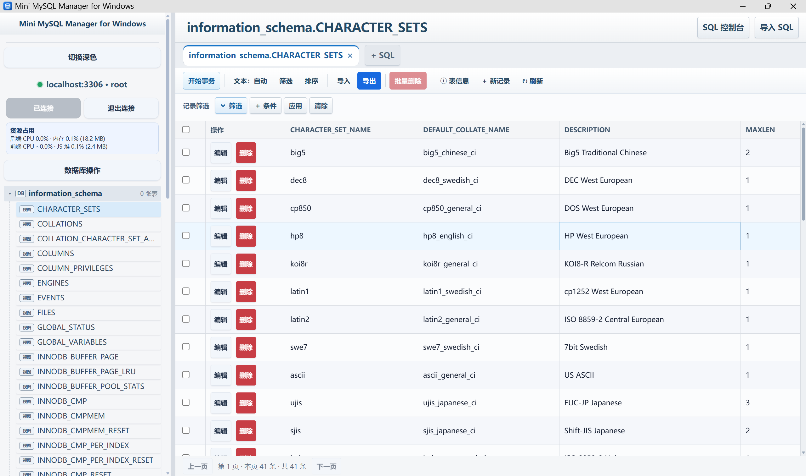

# Mini MySQL Manager for Windows

一个使用 Go 开发、可在 Windows 上直接运行的轻量级 MySQL 管理服务。程序启动后提供本地 Web 管理界面，支持登录 MySQL、浏览数据库和表、筛选排序与 SQL 查询、记录和表结构维护，以及 SQL 导入导出与整库备份恢复。



## 功能

- 连接 MySQL 服务器并浏览数据库、表和视图；连接权限、对象树和表记录数会在本地服务存活期间缓存，可选择在当前浏览器中记住登录信息。
- 分页查看表数据，支持最多 8 个筛选条件组合（AND / OR）及最多 8 个字段的升降序排序；可复制整条记录（自增主键会自动跳过），并批量删除选中记录。
- 编辑、新增和删除记录；无主键表会使用整行原始数据定位记录。支持开启、提交或回滚当前表操作事务，未提交的数据会立即显示在表格中。
- 管理表结构：新建表、查看表信息和 `CREATE TABLE` 语句、重命名或清空表、修改字段名称/类型/可空性/主键，以及维护字段和索引。
- 数据库操作支持创建/删除数据库，以及整库备份下载与备份上传恢复（`.sql.gz`）；备份采用一致性快照流式导出，并显示进度。
- SQL 控制台支持多标签页、查询结果分页；表名支持分段前缀与连续首字母补全，WHERE 等位置可补全字段，也支持 `表名.字段前缀`。可按连接和数据库保存查询，并将查询结果选择性导出为 UTF-8 CSV（单次最多 10 万行）。
- 导入 `.sql` 或 `.sql.gz` 文件，默认开启兼容模式，提供进度显示和取消操作；逻辑导出可包含表结构和当前筛选结果或整表数据。SQL、CSV 和备份文件会保存到程序所在目录，避免受浏览器下载设置影响。
- 支持 MySQL 常见的 `mysql_native_password` 和 `caching_sha2_password` 认证方式，以及 MariaDB `client_ed25519` 认证插件。
- 默认仅监听 `127.0.0.1`，不向局域网暴露管理界面；在 Chromium 系浏览器中会以独立应用窗口打开。

## 快速开始

1. 从 Releases 下载 `MiniMySQLManager.exe`，或按下文步骤自行构建。
2. 双击 `MiniMySQLManager.exe`。控制台窗口会保留；关闭该窗口即可停止服务。
3. 浏览器会自动打开 `http://127.0.0.1:52013`。
4. 在“连接 MySQL”页面填写主机、端口、用户名和密码；可勾选“记住登录信息”，将连接信息保存在当前浏览器。请勿在公用电脑上启用此选项。
   - 端口默认：`3306`
   - 用户名默认：`root`
   - 密码默认：**空**
5. 连接成功后，选择数据库和表即可管理数据。

如果浏览器没有自动打开，请在浏览器中访问控制台显示的地址。

## 系统要求

### 运行已构建的程序

- Windows 10 / 11（64 位）
- 能访问目标 MySQL 实例的网络权限
- 目标数据库账号应具有与你要执行的操作相匹配的最小权限

### 从源码构建

- Windows
- Go 1.24 或更高版本

项目随附 `github.com/go-sql-driver/mysql` v1.10.0 及其 `filippo.io/edwards25519` v1.2.0 依赖源码，位于 `third_party/`。在依赖未变化的情况下，构建不需要从网络下载驱动依赖。

## 启动参数与环境变量

所有选项都可通过命令行参数或环境变量设置；命令行参数适合临时使用，环境变量适合受控的本地自动化。

| 作用          | 命令行参数             | 环境变量                 | 默认值              |
| ----------- | ----------------- | -------------------- | ---------------- |
| Web 监听地址    | `-addr`           | `MYSQL_MANAGER_ADDR` | `127.0.0.1:52013` |
| 初始 MySQL 主机 | `-mysql-host`     | `MYSQL_HOST`         | 空                |
| 初始 MySQL 端口 | `-mysql-port`     | `MYSQL_PORT`         | `3306`           |
| 初始 MySQL 用户 | `-mysql-user`     | `MYSQL_USER`         | `root`           |
| 初始 MySQL 密码 | `-mysql-password` | `MYSQL_PASSWORD`     | 空                |
| 自动打开浏览器     | `-open-browser`   | —                    | `true`           |

示例：使用另一个本地端口启动，并手动连接数据库：

```bat
MiniMySQLManager.exe -addr 127.0.0.1:18080
```

示例：启动时预填主机和用户名，但不在命令中暴露密码：

```bat
set MYSQL_HOST=127.0.0.1
set MYSQL_USER=readonly_user
MiniMySQLManager.exe -open-browser=false
```

> 命令行参数可能被本机其他具有相应权限的进程查看；环境变量也会被子进程继承。对于长期或高敏感度使用，请优先在界面中手动输入密码，并使用专用、最小权限的数据库账号。

## 构建

在项目根目录执行：

```bat
go build -v -trimpath -ldflags="-s -w" -o MiniMySQLManager.exe .
```

构建成功后会生成 `MiniMySQLManager.exe`。

## 使用说明与限制

- **数据修改：** 有主键时使用主键定位；没有主键时使用整行原始数据定位。若存在完全相同的重复行，编辑或删除可能同时影响多条记录。
- **查询：** 查询结果默认每页最多 100 行，单次最多 500 行。复杂 SQL 的执行超时为 60 秒。
- **导入 / 备份恢复：** 支持 `.sql` 和 `.sql.gz`，未设置固定文件大小上限；大文件会写入系统临时目录，实际可导入大小取决于可用磁盘空间、系统资源和 MySQL 的限制。导入由 MySQL 执行；如果脚本后半部分失败，前面已成功执行的语句不会自动回滚。备份上传恢复仅接受本程序导出的 `.sql.gz`；脚本中的建库/切库语句会被忽略，数据写入所选目标库，同名表可能被替换。
- **导出 / 整库备份：** 表导出会生成 `DROP TABLE IF EXISTS`、`CREATE TABLE`，并可选择导出当前筛选结果或整表数据为批量 `INSERT` 语句；SQL 控制台查询可导出为 CSV（最多 10 万行）。整库备份会导出为 `.sql.gz` 并保存到程序所在目录。导出与备份文件可能含有业务敏感数据，请妥善保存，且不要提交到 Git。
- **事务：** 同一时间仅维护一个本地表操作事务；重新连接或断开连接时，未完成的事务会自动回滚。
- **结构修改：** 修改已有字段类型前，如表中存在数据，程序会要求再次确认；请先备份并在测试库验证转换结果。
- **网络：** 默认仅限本机访问。若主动将 `-addr` 设置为 `0.0.0.0:端口`，请先部署防火墙、访问控制和额外认证措施；该工具本身不适合直接暴露到公网。

## 安全建议

1. 为此工具创建专用数据库账号，并按需授予数据库和操作权限。
2. 不要将密码、令牌或其他敏感信息提交到 Git 历史。
3. 不要提交 `.env`、SQL 导出、日志、证书或私钥；项目的 `.gitignore` 已默认忽略这些常见敏感文件。
4. 使用完成后关闭程序的控制台窗口，以停止本地 Web 服务和数据库连接。
5. 如曾把密码提交到任何远程仓库，应立即在数据库中轮换该密码；只删除文件无法消除 Git 历史中的泄露。

## 项目结构

```text
.
├── main.go                 # Go 后端、HTTP API 与嵌入式静态页面
├── backup_engine.go        # SQL 导入导出与整库备份
├── web/index.html          # 管理界面
├── third_party/mysql       # 随项目附带的 MySQL 驱动源码
├── third_party/edwards25519 # MySQL 驱动的本地依赖源码
└── go.mod                  # Go 模块与本地驱动替换配置
```

## 开发与验证

修改 Go 源码后，可运行：

```bat
go build ./...
```

随后启动新生成的 `MiniMySQLManager.exe`，在本机测试连接、查询和修改操作。请使用测试数据库进行写入、导入和删除验证。

## 许可证

本项目采用 [MIT License](LICENSE)，版权归 `ATongHru` 所有。

本项目包含以下第三方依赖的源码副本；其许可证不改变本项目自身源代码的 MIT 许可证，但在再发布源代码或编译后的可执行文件时，必须保留相应的许可证文本、版权声明和第三方声明：

- `github.com/go-sql-driver/mysql` v1.10.0 受 [MPL-2.0](LICENSE-MPL20) 约束；其原始许可证见 [`third_party/mysql/LICENSE`](third_party/mysql/LICENSE)。对该驱动源码文件的修改须继续按 MPL-2.0 提供相应源代码。
- `filippo.io/edwards25519` v1.2.0 受 BSD-3-Clause 许可证约束；原始许可证见 [`third_party/edwards25519/LICENSE`](third_party/edwards25519/LICENSE)。
- 完整的第三方依赖与许可证声明见 [NOTICE](NOTICE)。

上述目录中的原始版权声明和许可证文本均已保留。
